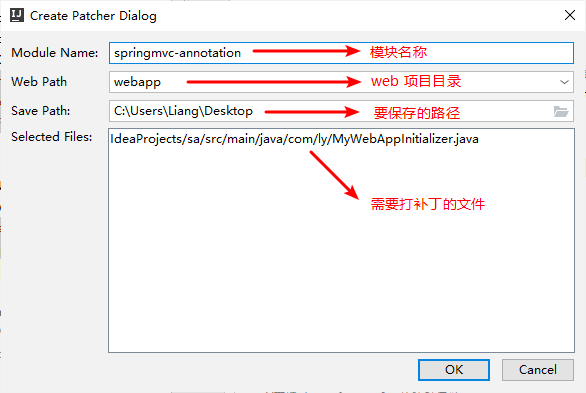
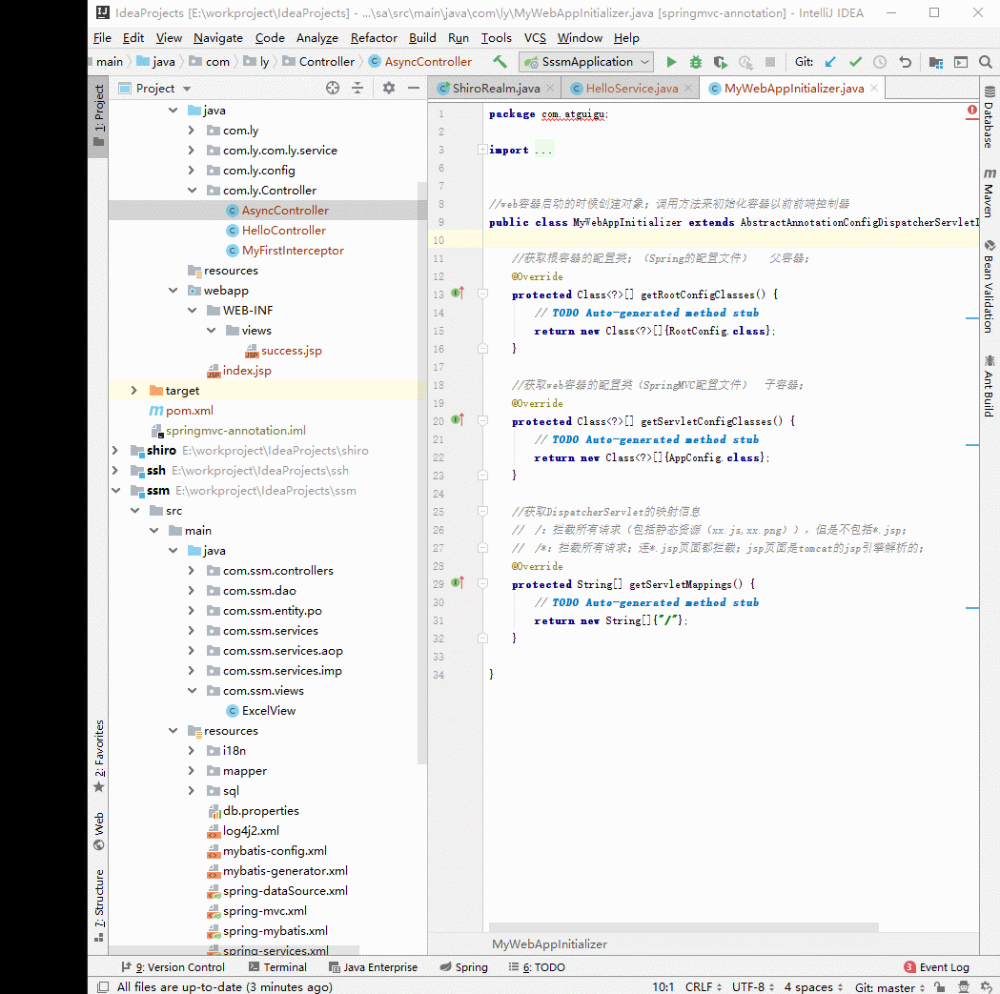

# Patcher
IntelliJ IDEA 导出增量补丁插件
**感谢：https://github.com/serical/patcher**

# 说明
适用于`Java`项目，客户现场除了第一次为全量部署外，后面的升级都是增量补丁，本插件可选择导出要升级的文件。

# 下载
在 IDEA 插件库查询 Patcher

# 使用
默认快捷键 `shift+alt+E`
选择你需要编译的源码文件位置，程序会自动找到编译后的class目录进行到处

# 演示

# 感谢支持
 